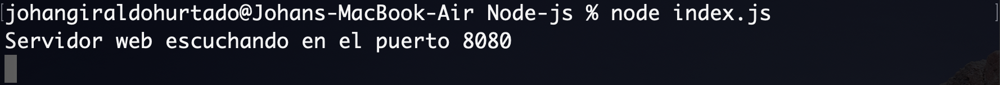

Desplegar un servicio web con node.js y crear un contenedor que despligue el servicio
===

JavaScript ha pasado de ser un lenguaje utilizado para brindar interactividad a las páginas web, a ser utilizado ahora también en el lado de los servidores gracias a Node.js. Si aún no tienes claro qué es Node.js, puedes revisar este artículo sobre [qué es Node.js](https://devcode.la/blog/que-es-nodejs/), donde aprenderás los conceptos básicos que necesitas saber sobre él. Dentro de Node, el código se organiza por módulos o paquetes, así que al momento de trabajar con él va a ser necesario agregar más módulos, es aquí donde entra npm, es el ecosistema más grande de librerías de código abierto en el mundo.

Node.js permite crear un servidor web, para crearlo, vamos a utilizar NPM (Node Package Manager) y express.js un frawework web.

Crear un nuevo directorio llamado Node-js

```
mkdir Node-js
```

acceder a este directorio

```
cd Node-js
```

iniciar el proyecto

```
npm init
```

Luego obtendra la siguiente salida y debera ingresar algunos datos, como muestra la siguiente imagen.

<br>

**npm init** genera un archivo **package.json**

<br>

Este fichero contiene la información anteriormente proporcionada y además se encarga de controlar los paquetes que instalamos para el proyecto. Por ejemplo, para poder crear nuestro servidor rápidamente, vamos a instalar un paquete llamado **express.js**

```
npm install express --save
```

Este comando instala **express.js** y además actualiza nuestro archivo package.json gracias al parámetro --save

<br>

Hay una parte importante que nos permitirá ver el funcionamiento del servidor web

```
app.use(express.static(__dirname + '/public/'));
```

* ```__dirname``` es la raíz del proyecto

Esta línea le indica al servidor que cuando un usuario haga una petición de archivos estáticos, por ejemplo, ```http://localhost:8080/index.html``` enviará como respuesta el contenido de ```./public/index.html```

Luego, se crear la carpeta ```public``` y el archivo ```index.html``` con el editor de preferencia o en línea de comandos.

Para ejecutar el servidor web, se posiciona dentro del directorio **Node-js** y se ejecuta el siguiente comando:

```
node index.js
```

Se observara el siguiente mensaje por consola

<br>

Por último, abrir el navegador web y se obtendra el index.html, utilizando ```http://localhost:8080``` o ```http://localhost:8080/index.html```

<br>

Crea un Dockerfile para Node.js
===

Un Dockerfile es un documento de texto que contiene todos los comandos que un usuario puede llamar en la línea de comandos para ensamblar una imagen. Cuando le decimos a Docker que cree nuestra imagen ejecutando el comando ```docker build```, Docker lee estas instrucciones y las ejecuta una por una y crea una imagen de Docker como resultado.

Repasemos el proceso de creación de un [Dockerfile](https://jsgiraldoh.io/Blog/Dockerfile) para nuestra aplicación. En la raíz de su directorio de trabajo, cree un archivo llamado ```Dockerfile``` y abra este archivo en su editor de texto.

Lo primero que debemos hacer es agregar una línea en nuestro Dockerfile que le diga a Docker qué imagen base nos gustaría usar para nuestra aplicación.

```
FROM node:carbon
```

Para facilitar las cosas al ejecutar el resto de nuestros comandos, creemos un directorio de trabajo. Esto le indica a Docker que use esta ruta como la ubicación predeterminada para todos los comandos posteriores. De esta manera, no tenemos que escribir las rutas de archivo completas, pero podemos usar rutas relativas basadas en el directorio de trabajo.

```
WORKDIR /usr/src/app
```

Por lo general, lo primero que hace una vez que ha descargado un proyecto escrito en Node.js es instalar paquetes npm. Esto asegura que su aplicación tenga todas sus dependencias instaladas en el directorio ```node_modules``` donde el tiempo de ejecución de Node podrá encontrarlas.

Antes de que podamos ejecutar ```npm install```, necesitamos incluir nuestros archivos ```package.json``` y ```package-lock.json``` en nuestras imágenes. Usamos el COPYcomando para hacer esto. El comando ```COPY``` toma dos parámetros. El primer parámetro le dice a Docker qué archivo (s) le gustaría copiar en la imagen. El segundo parámetro le dice a Docker dónde desea que se copien esos archivos. Copiaremos el archivo ```package.json``` y ```package-lock.json``` en nuestro directorio de trabajo ```/usr/src/app```

```
COPY . .
```

Una vez que tenemos nuestros archivos ```package.json``` dentro de la imagen, podemos usar el comando ```RUN``` para ejecutar el comando npm install. Esto funciona exactamente igual que si estuviéramos ejecutando npm install localmente en nuestra máquina, pero esta vez estos módulos de nodo se instalarán en el directorio ```node_modules``` dentro de nuestra imagen.

```
RUN npm install
```

Ahora, todo lo que tenemos que hacer es decirle a Docker qué comando queremos ejecutar cuando nuestra imagen se ejecuta dentro de un contenedor. Hacemos esto con el comando ```CMD.```

```
CMD ["npm", "start"]
```

Aquí está el Dockerfile completo.

```
FROM node:carbon

WORKDIR /usr/src/app

COPY . .

RUN npm install

EXPOSE 8080

CMD ["npm", "start"]
```

Luego, se procede a contruir la imagen de Docker a partir del fichero Dockerfile que hemos realizado.

```
docker build -t node-js-server-web-blog ./
```

Para finalizar, se debe ejecutar el contenedor de Docker con la imagen anteriormente creada.

```
docker run --name=node-js-server-web-blog -p 8080:8080 -d node-js-server-web-blog
```

Abrir el navegador web y se obtendra el index.html, utilizando ```http://localhost:8080``` o ```http://localhost:8080/index.html```

<br>

[Aquí](https://github.com/jsgiraldoh/Node-js-server-web-blog.git) se puede encontrar una aplicación de ejemplo que ejercita todos los aspectos que se discutieron.

Si desea, observar el resultado final, sin necesidad de hacer todo el proceso, ya he preparado una imagen de Docker, la cual puede ejecutar con el siguiente comando

```
docker run --name=node-js-server-web-blog -p 8080:8080 -d jsgiraldoh/node-js-server-web-blog
```

# Referencias

https://devcode.la/blog/que-es-npm/

https://devcode.la/blog/que-es-nodejs/

https://nodejs.org/es/

https://www.pensemosweb.com/como-crear-servidor-web-5-minutos-nodejs/

https://github.com/juanda99/curso-node-js/blob/master/5-express.md

https://expressjs.com/es/guide/using-middleware.html

https://docs.docker.com/language/nodejs/build-images/

https://www.digitalocean.com/community/tutorials/como-crear-una-aplicacion-node-js-con-docker-es
